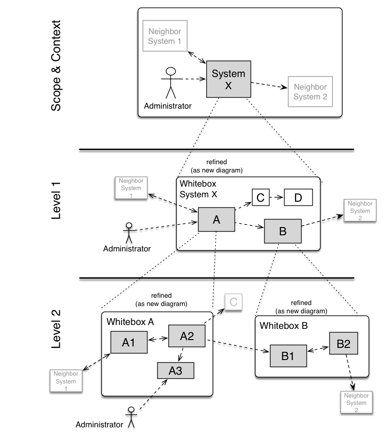

# 5 Building Block View 

> The building block view shows the static decomposition of the system into building blocks (modules, components, subsystems, classes, interfaces, packages, libraries, frameworks, layers, partitions, tiers, functions, macros, operations, data structures, …) as well as their dependencies (relationships, associations, …)
>
> This view is mandatory for every architecture documentation. In analogy to a house this is the floor plan.

[arc42 section 5](https://docs.arc42.org/section-5/)

## 5.1 Whitebox Overall System 

> Here you describe the decomposition of the overall system using the following white box template. It contains
>
> * an overview diagram
> * a motivation for the decomposition
> * black box descriptions of the contained building blocks. For these we offer you alternatives:
>   * use one table for a short and pragmatic overview of all contained building blocks and their interfaces
>   * use a list of black box descriptions of the building blocks according to the black box template (see below). Depending on your choice of tool this list could be sub-chapters (in text files), sub-pages (in a Wiki) or nested elements (in a modelling tool).
> * (optional:) important interfaces, that are not explained in the black box templates of a building block, but are very important for understanding the white box.
> 
> Since there are so many ways to specify interfaces why do not provide a specific template for them.
>
> In the best case you will get away with examples or simple signatures.

## 5.2 Level 2

## 5.3 Level 3 ..
